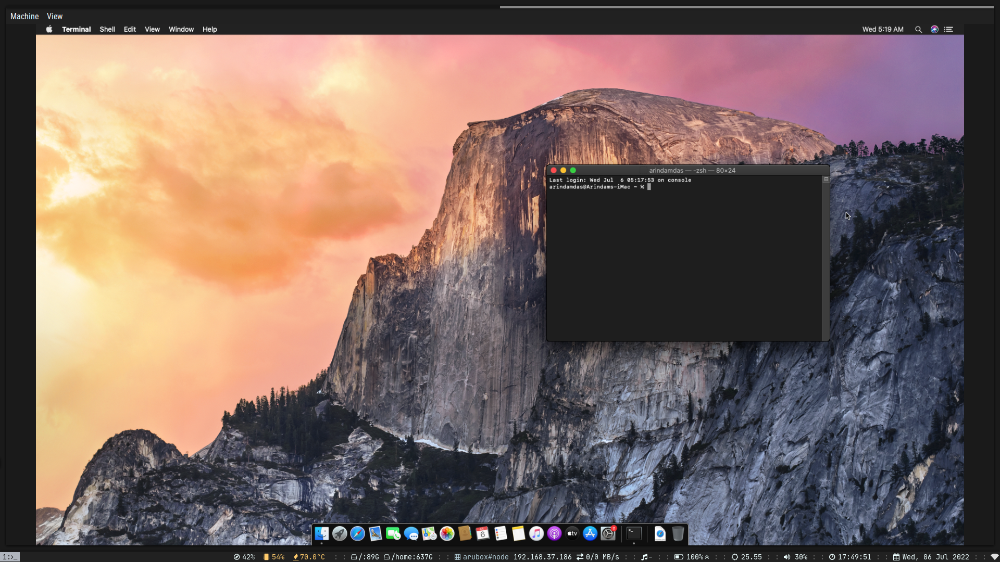

# mac-on-linux-with-qemu

Runs macOS on linux with qemu.

## Pre-requisites

- `qemu-system-x86_64`
- `dmg2img`
- `pulseaudio`
- `python[click]`

## Usage

After cloning the repository, simply run `./run.sh`

## How it works

- [x] `./fetch-macos.py` fetches macOS image dmg from their software update centre
- [x] The downloaded .dmg image is converted to .img using the `dmg2img` utility
- [x] We create a virtual disk image using `./create-virtual-disk.sh`
- [x] We install macOS to qemu using the given image. `./install-macos.sh`
- [x] We provide a custom launcher script to launch qemu with the correct settings. `./launch-macos.sh`

## Closed issues solving relevant tasks
- [Xcode and usb iphone passthrough for ios App development](https://github.com/arindas/mac-on-linux-with-qemu/issues/25)

## Closed issues solving common problems
- [archlinux: virtio-vga support lost after qemu and kernel upgrade](https://github.com/arindas/mac-on-linux-with-qemu/issues/24)
- [Freeze on Big Sur using the new ESP.qcow2 resolved](https://github.com/arindas/mac-on-linux-with-qemu/issues/21)

## References
- https://github.com/popey/sosumi-snap
